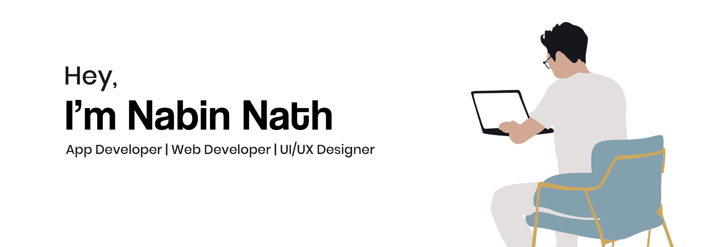

##

I'm a Electronics Enthusiast  👨‍💻, Currently in second year at National Institute of Technology, Hamirpur. 👨‍🎓

  

- 🔭 I’m currently working on my Web Development Skills.  
- 🌱 I’m passionate about Data Structures and Flutter. 
- 👯 I’m looking to collaborate on Flutter, Android and Web development Projects.
- 🤔 I’m looking for help in learning about Nodejs. 
- 💬 Ask me about anything and everything 
- 📫 How to reach me: &nbsp;&nbsp;
- ⚡ Fun fact:  There are more possible iterations of game of Chess then there are atoms in the known universe.

### Some Stats About Nabin (Public Only)

 

&nbsp;&nbsp;
&nbsp;&nbsp;
&nbsp;&nbsp;

